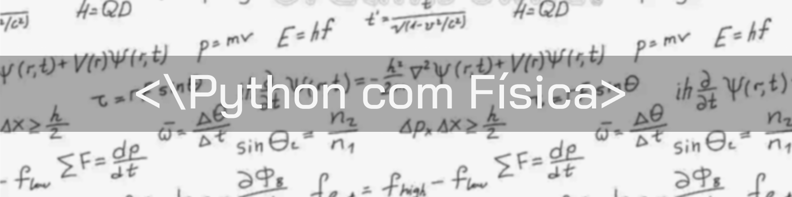

# Python com Física

  

Neste repositório, vou postar projetos de física utilizando o Python através do **Trinket** e o **VPython**.

## Ampliando o aprendizado em Física com Python

Trinket é uma plataforma baseada na web que oferece uma variedade de ferramentas educacionais para programação e ensino de ciência da computação.
Ela permite que os usuários escrevam, executem e compartilhem trechos de código em várias linguagens de programação, incluindo Python, HTML, CSS e JavaScript.
A plataforma é projetada para ser um ambiente fácil de usar e acessível para aprender e ensinar conceitos de programação e ciência da computação.

VPython é uma biblioteca de gráficos 3D para a linguagem de programação Python. Ela é especificamente projetada para fins científicos e educacionais e
fornece uma maneira simples e intuitiva para os usuários criarem e manipularem gráficos 3D e animações.

## Projetos
 
### Mecânica

* [Cinemática unidimensional e introdução ao método de Euler](https://trinket.io/library/trinkets)
* [Prevendo colisão de carros](https://trinket.io/library/trinkets/62d19f0a40)
* [Movimento de projétil](https://trinket.io/library/trinkets/cde484ebfe)
* [Movimento de projétil com resistência do ar](https://trinket.io/library/trinkets/50b5b20f9b)
* [Alcance máximo do projétil](https://trinket.io/library/trinkets/2eee313e10)
* [Alcance máximo do projétil com resistência do ar](https://trinket.io/library/trinkets/f11cb3557d)
* [Relação entre raio da esfera e alcance máximo, com resistência do ar](https://trinket.io/library/trinkets/beee39cf8b)
* [Pêndulo Simples](https://trinket.io/glowscript/47dd97aa98)
* [Pêndulo Duplo](https://trinket.io/glowscript/e92cdd5316)
* [Conta deslizando em um fio](https://trinket.io/glowscript/65d5628d91)
* [Satélite em órbita](https://trinket.io/glowscript/52576805dc)
* [Movimento harmônico simples](https://trinket.io/glowscript/7406d9ff59)

