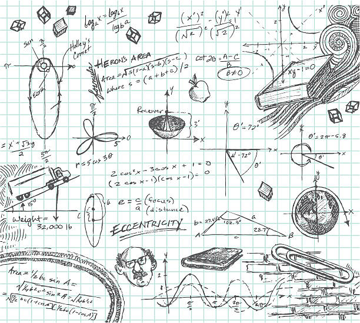

# PhysicsTrinkets
Here are some of my physics simulations using vpython.

  

## Physics is more fun when you can see it working.

The majority of the projects were done using **Trinket** and **VPython**.

Trinket is a web-based platform that provides a variety of educational tools for programming and computer science education. 
It allows users to write, run, and share code snippets in a variety of programming languages including Python, HTML, CSS, and JavaScript. 
The platform is designed to be an easy-to-use and accessible environment for learning and teaching programming and computer science concepts.

VPython is a 3D graphics library for the Python programming language. It is specifically designed for scientific and educational purposes and 
provides a simple, intuitive way for users to create and manipulate 3D graphics and animations.

### Physics simulations:
 
 * [Simple Pendulum](https://trinket.io/glowscript/47dd97aa98)
 * [Double Pendulum](https://trinket.io/glowscript/e92cdd5316)
 * [Sliding bead on a tilting wire](https://trinket.io/glowscript/65d5628d91)
 * [Spacecraft in orbit](https://trinket.io/glowscript/52576805dc)
 
Hope you enjoy this!

